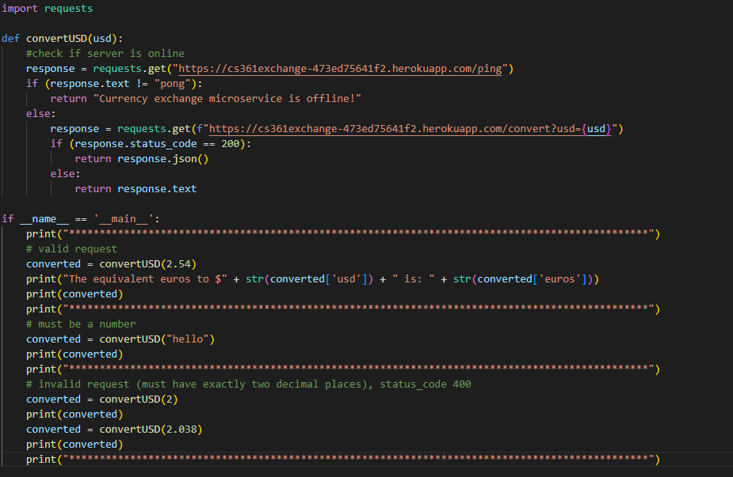
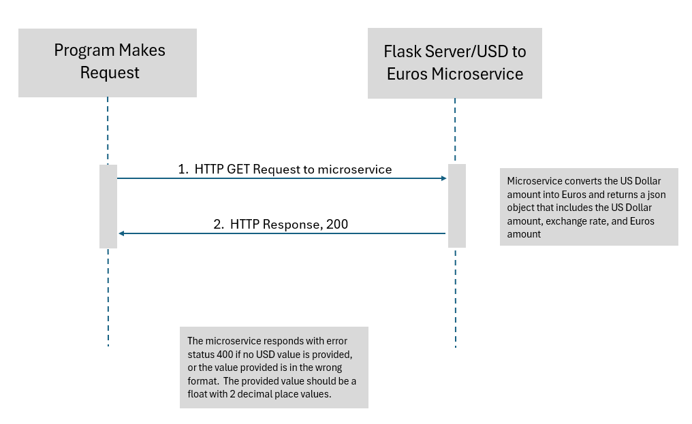

# cs361 - Microservice A - Currency exchange from USD to Euros

This microservice converts US Dollars into Euros.  

## How to check if microservice is online
Send a GET request to "https://cs361exchange-473ed75641f2.herokuapp.com/ping".
Check response text, if text is "pong" that means the service is online, else it is offline

## How to send a conversion request
Send a GET request to "https://cs361exchange-473ed75641f2.herokuapp.com/convert?usd={usd}"
Replace {usd} with actual dollar amount w/ two decimal digits (will return error if it doesn't have two decimal digits)
Check response, if status code is 200, conversion is successful.  Else, something went wrong.  Check response for specific error.
For successful conversion, check returned json.  It should have the following keys 'euros', 'usd', and 'exchangeRate'.  

## Overview of how to request and recieve data
### 

## UML
### 

